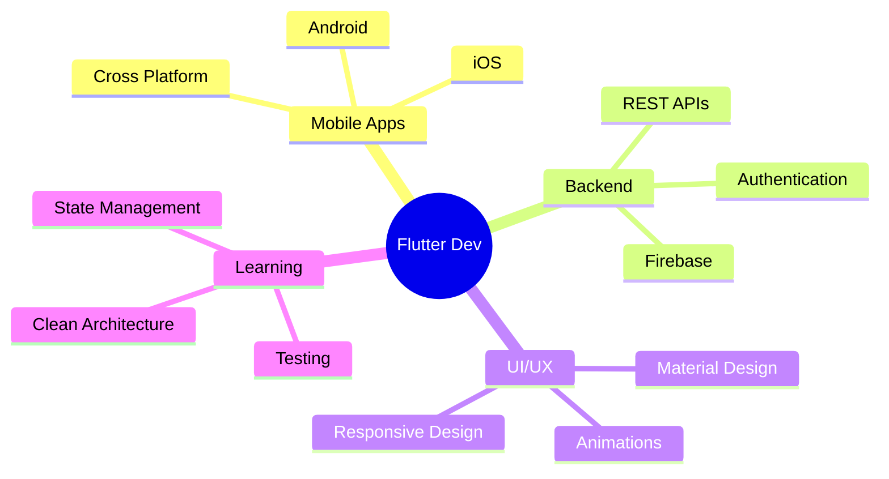

<div align="center">
  
</div>

<div align="center">
  
</div>

<br>

<div align="center">
  
[](https://linkedin.com/in/tu-usuario)
[](mailto:tu-email@gmail.com)
[](https://twitter.com/tu-usuario)
[](https://tu-portfolio.com)

</div>

---


## 🚀 Sobre Mí

```dart
class Developer {
  final String name = "Tu Nombre";
  final String role = "Flutter Developer";
  final String location = "São Paulo, Brasil";
  
  List<String> languages = [
    "Dart", "JavaScript", "HTML", "CSS"
  ];
  
  List<String> specialties = [
    "📱 Apps Móviles",
    "🔔 Push Notifications",
    "🎨 UI/UX Design",
    "🔥 Firebase Integration",
    "⚡ API REST"
  ];
  
  String currentFocus = "Creando experiencias móviles increíbles";
  String funFact = "El mejor código se escribe con música 🎵";
  
  void sayHi() {
    print("¡Construyamos algo asombroso juntos! 🚀");
  }
}
```

<br clear="right"/>

---

## 🛠️ Tech Stack

<div align="center">

### Mobile Development


### Backend & Database


### Web Technologies


### Tools & Others


</div>

---

## 📊 GitHub Analytics

<div align="center">
  
  
</div>

<div align="center">
  
</div>

<br>

<div align="center">
  
</div>

---

## 🔥 Featured Projects

<div align="center">

<a href="https://github.com/tu-usuario/proyecto1">
  
</a>

<a href="https://github.com/tu-usuario/proyecto2">
  
</a>

</div>

---

## 📈 Contribution Graph

<div align="center">
  
</div>

---

## 🎯 Current Focus

<div align="center">



</div>

---

## 💡 Developer Quote

<div align="center">


</div>

---

## 🎵 Spotify Playing

<div align="center">
  
[](https://open.spotify.com/user/tu-spotify-id)

</div>

---

## 📬 Get in Touch

<div align="center">

**¿Quieres colaborar en un proyecto? ¿Tienes una idea increíble?**

**¡Hablemos! 💬**

</div>

<div align="center">
  
[](mailto:tu-email@gmail.com)
[](https://linkedin.com/in/tu-usuario)

</div>

---

<div align="center">

### 👨‍💻 Profile Views


### ⭐ From [tu-usuario](https://github.com/tu-usuario)

**Si te gusta mi trabajo, ¡no olvides darle una estrella a mis repositorios!** 🌟

</div>

---


